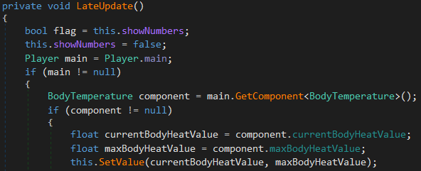
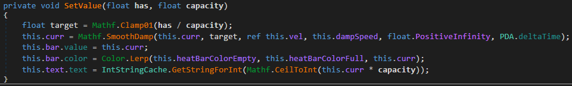

### How to manually patch it

All Unity3D games have their main C# code compiled by Unity in a file called Assembly-CSharp.dll, and in the case of Subnautica that file can be found inside the *[GAME_FOLDER]\SubnauticaZero_Data\Managed* folder. 

After opening it with a C# decompiler (I used dnSpy), the next step was to find the exact code that updated the temperature value shown on the player hud, in order to convert it to its corresponding Celsius representation. 
It's very important to apply this conversion just before this value is shown by the game hud, and not when it is calcucated, in order to not alter in any way the game temperature simulation.

Finding that specific method wasn't straightforward (searching for keywords like "temperature" didn't help), but in the end I found it inside the uGUI_BodyHeatMeter class. Inside this class the first thing I was looking for was a method called LateUpdate, which is a method common to all objects inheriting from the MonoBehaviour class (provided by Unity), that gets called every frame by the Unity engine after all the various Update methods have terminated. Usually this is the method where the UI gets updated, right after all the underlying data (including the temperature) has been updated in the Update methods.

And there it was:



At the start of the method there's a reference to the BodyTemperature component taken from the player object. Then the heat values taken from it are passed to another method wih a quite explicit name, SetValue. Jumping to that method, it's clear that SetValue actually sets the value displayed by the temperature gauge in the player hud. 



The last instruction is the one that updates the temperature text, so that's the right place to convert the temperature value from Fahrenheit to Celsius (also note the IntStringChache class used to convert the temperature value to its string representation; this way they avoid to instantiate a new string at every frame, by reusing the same string for the same number. Very smart!).

The formula for the conversion is C = (F - 32) / 1.8, so applying it in the last line is all we need to do.

```csharp
this.text.text = IntStringCache.GetStringForInt(Mathf.CeilToInt((this.curr * capacity - 32f) / 1.8f));
```

Patching the method at the IL level (which is what my tool does) is equally simple. After the mul instruction (that pushes the result of **this.curr * capacity** on the stack), add the following instructions:

```cil
ldc.r4 32
sub
ldc.r4 1,8
div
```
Note that the ldc.r4 instructions pushes a 4 byte floating point number on the stack. It's necessary to use this (and not the int32 equivalent ldc.i4) with 32 because the multiplication result is a float, thus 32 needs to be represented as a float too so that the CPU can operate on them toghether.
